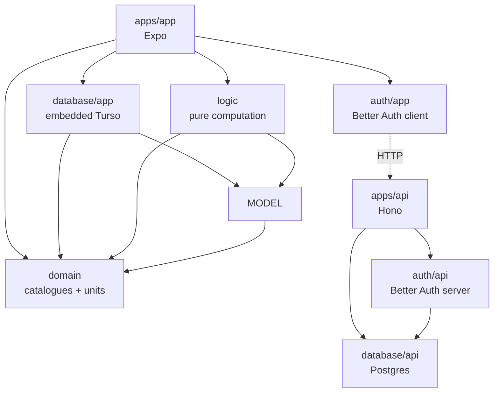

# Bro

A men's wellbeing app: an Expo mobile client backed by a Hono API, in an Nx + pnpm monorepo.

The app is **offline-first** — it reads and writes its own embedded database on the device, so the UI never waits on the network. The API owns the authoritative Postgres database and authentication. Remote database sync is planned but is not enabled by the app yet.

## Layout

```
apps/
  app/                     @bro/app           Expo (SDK 56) mobile client
  api/                     @bro/api           Hono API server (Node)
packages/
  database/
    api/                   @bro/database-api  Postgres schema, migrations, Drizzle client
    app/                   @bro/database-app  Embedded Turso/libSQL access + repositories
  auth/
    api/                   @bro/auth-api      Better Auth server configuration
    app/                   @bro/auth-app      Better Auth Expo client, provider, hooks
  domain/                  @bro/domain        Shared catalogues, metric registry, units logic
  mobile-model/            @bro/mobile-model  Persistence-independent mobile record contracts
  logic/                   @bro/logic         Pure computation over mobile records
```

`database` and `auth` are each split into an `api` and an `app` half. The two halves never import each other, so server-only code (Postgres driver, Drizzle, auth secret) can't be pulled into the React Native bundle.

`domain` is the exception to the split: pure TypeScript with no runtime dependencies, holding the product's definitional core — the content catalogues (habits, challenges, insights, life areas), the metric registry, unit conversion/formatting, and shared vocabulary types. It is tagged `scope:shared`, so ESLint lets both sides depend on it while it may depend on nothing. The app consumes it today; the API can adopt it when it grows server-side features.

`mobile-model` owns database-independent record shapes. Both `database/app` and `logic` depend on it, so repository implementation and migration changes do not invalidate pure computation. `database/app` re-exports these types for compatibility, while `logic` imports their owning package directly.



Directories nest but package names flatten (`packages/database/api` → `@bro/database-api`), because npm names can't contain a slash past the scope. Nested packages are picked up by the `packages/*/*` glob in `pnpm-workspace.yaml` — without it, pnpm never creates the `@bro/*` symlinks and nothing resolves.

## Two databases, two access patterns

| | App (`@bro/database-app`) | API (`@bro/database-api`) |
|---|---|---|
| Store | Embedded libSQL/Turso on device | Postgres |
| Runtime queries | Hand-written SQL via repositories | Drizzle query client |
| Role of Drizzle | Schema authoring + migration codegen only | Schema *and* runtime client |
| Migrations run | At app startup, on device | Via `db:migrate` against a server |

On the app side the Drizzle client is deliberately kept out of the runtime path. `src/schema.ts` exists purely to drive `drizzle-kit generate`; queries go through one repository class per data domain, each issuing parameterised SQL over `expo-sqlite`'s raw API. See [the repository recipe](packages/database/app/src/repositories/README.md) for how to add one.

Migration SQL is compiled into `src/migrations/manifest.ts` as plain strings by a [small script](packages/database/app/scripts/generate-migrations-manifest.ts), because Metro can't read files off disk at runtime. This avoids needing `babel-plugin-inline-import` and Metro `sourceExts` changes across the package boundary.

### Local storage and future Turso sync

[`connection.ts`](packages/database/app/src/connection.ts) opens a purely local SQLite product database, one per device. Device-only metadata lives separately in `bro-device.db` as key-value pairs read synchronously, so onboarding, app-lock preferences, installation identity, and session hints can never replicate. Phase 5 will reintroduce embedded replicas with short-lived, database-scoped credentials minted by the API; no Turso credential is accepted from an Expo build-time environment variable.

## Auth

Better Auth, with the server half in `@bro/auth-api` and the client half in `@bro/auth-app`. These are necessarily separate — `createAuthClient` infers its types from the options you pass it, not from the server instance, and the server config carries the database and secret.

Each server plugin needs its client counterpart, and three values are paired by hand across the boundary:

| Concern | Server (`auth/api`) | Client (`auth/app`) |
|---|---|---|
| Plugin | `expo()` | `expoClient()` |
| App scheme | `defaultTrustedOrigins` | `expoClient({ scheme })` |
| Address | `baseURL` | `baseURL` from `EXPO_PUBLIC_API_URL` |

Within the server side, every option that affects the database schema lives in [`options.ts`](packages/auth/api/src/options.ts), shared by the runtime factory and by [`better-auth.config.ts`](packages/auth/api/better-auth.config.ts), which exists only so the CLI can generate the schema. That's what stops the generated tables from drifting from the runtime config.

The auth tables in [`database/api/src/schema/auth.ts`](packages/database/api/src/schema/auth.ts) are **generated** — regenerate with `nx run @bro/auth-api:auth:generate-schema` after changing auth plugins or options, then generate and apply a migration. Note the CLI is published as `auth`, not `@better-auth/cli` (which is stranded on an old version).

When custom `user`/`session` fields are added, the client will need `inferAdditionalFields<typeof auth>()` to know about them — a type-only generic, so it doesn't bundle server code.

Accounts are optional and never gate local app entry. The in-app Account route owns sign-in, registration, local-first sign-out, retrying a stored session, account switching, and password-confirmed deletion. Deletion is server-first: a failed request preserves the session marker and all local data; success removes the Better Auth user/account/session rows, clears the supported Expo auth cache, and leaves `bro.db` open.

### Auth integration tests

Account deletion is exercised through Hono and Better Auth with Vitest. Testcontainers starts a fresh PostgreSQL container, applies the real migrations, and removes the container after the suite; no test database URL or manually managed Compose service is required.

```sh
pnpm nx run @bro/api:test
```

## Getting started

Requires Node 20+, pnpm, and Docker.

```sh
pnpm install
cp .env.example .env                  # then set BETTER_AUTH_SECRET
cp apps/app/.env.example apps/app/.env

docker compose up -d                  # Postgres on :5432
pnpm exec nx run @bro/database-api:db:migrate

pnpm exec nx run @bro/api:serve       # API on :3000
pnpm exec nx run app:start            # Expo dev server
```

Generate a secret with `openssl rand -base64 32`. For the Android emulator, set
`EXPO_PUBLIC_API_URL=http://10.0.2.2:3000`; Android reserves `10.0.2.2` as an
alias to the development machine. The iOS simulator and web can use
`http://localhost:3000`. On a physical device, use your machine's LAN IP.

## Common tasks

| Command | Purpose |
|---|---|
| `nx run @bro/api:serve` | Run the development esbuild bundle with watch and automatic restart |
| `nx run @bro/api:build` | Production bundle (esbuild) |
| `pnpm nx run @bro/api:test` | Run API integration tests with Vitest and Testcontainers |
| `pnpm nx run @bro/app:test` | Run the Expo router, Account, startup, and storage tests |
| `pnpm nx run @bro/database-app:test` | Run embedded-database repository and migration tests |
| `pnpm nx run-many -t test-ci` | Run atomized per-file unit-test targets |
| `nx run app:start` | Expo dev server |
| `nx run @bro/database-api:db:generate` | Generate a Postgres migration from schema changes |
| `nx run @bro/database-api:db:migrate` | Apply pending Postgres migrations |
| `nx run @bro/database-app:db:generate` | Generate an app migration and rebuild the manifest |
| `nx run @bro/auth-api:auth:generate-schema` | Regenerate the Better Auth tables |
| `nx run-many -t typecheck` | Typecheck every project |
| `pnpm biome check --write` | Format and lint |

## Conventions

- **No `project.json`.** Nx config is inferred, with custom targets in each `package.json` under `nx.targets`.
- **Biome** owns formatting and general linting (tabs, double quotes). ESLint is intentionally limited to Nx module-boundary enforcement; run both with `pnpm lint`.
- **Module resolution differs by side.** The API-side packages use `nodenext`, so their relative imports carry `.js` suffixes. The app-side packages (`database/app`, `auth/app`, `mobile-model`, `logic`) and `domain` use `bundler` resolution with no suffixes, because Metro does not remap `.js` to `.ts`. Match the package you're editing.
- **TypeScript project references** are managed by `nx sync`; run it after adding a cross-package import.
- Dependencies shared with Expo must match the SDK. Check `node_modules/expo/bundledNativeModules.json` for the correct version rather than taking `latest`.

## Localisation

All user-facing copy in the app comes from typed catalogues in [`apps/app/src/i18n`](apps/app/src/i18n), read through i18next. The catalogues are TypeScript rather than JSON so that each entry can carry a translator note and so key types flow into `t()` without extra tsconfig setup — a typo or a deleted key fails `nx typecheck`.

- **Adding copy.** Put it in the namespace file for the feature (`locales/en/<feature>.ts`), or `common.ts` when two or more screens share it. New namespaces need one line in `locales/index.ts`; the key types follow automatically.
- **Interpolate, never concatenate.** Word order differs across languages, so build one string with `{{placeholders}}` rather than joining fragments in JSX.
- **`eslint-plugin-i18next` enforces this** for `apps/app/src/{app,components,screens}`, at error level. Tests are exempt: they assert on rendered English on purpose.
- **Pseudo-locale.** Run with `EXPO_PUBLIC_PSEUDO_LOCALE=1` to render every string accented, padded ~35%, and bracketed. Plain ASCII means copy that never reached a catalogue; clipped text means a layout that will not survive a longer language; a bracket mid-sentence means fragments that will not reorder. It is a tool for running the app — the test suite asserts English and will fail under it.
- **Outside the catalogues.** iOS permission prompts are read by the system before any JavaScript runs, so they live in [`apps/app/locales/en.json`](apps/app/locales/en.json), wired through the `locales` key in `app.json`.

Language follows the device and falls back to English. Dates, numbers, and units are formatted from the *device* locale via `Intl`, deliberately separate from the copy language, so a fallback to English copy does not also change number and date formats.

## Known rough edges

- [`auth/app/src/client.ts`](packages/auth/app/src/client.ts) carries a `@ts-expect-error` on the Expo plugin: `@better-auth/expo@1.6.27` types `getActions` incompatibly with `BetterAuthClientPlugin` even on matched dependency versions. It is suppressed rather than cast, because casting collapses session type inference. Remove it once upstream fixes the declaration.
- The app scheme `"app"` is repeated in `apps/app/app.json`, `auth/api/src/options.ts`, and `auth/app/src/client.ts`. Changing one alone breaks auth redirects silently.
- Turso sync is not wired into the app lifecycle yet. Phase 5 will add short-lived, database-scoped tokens minted by the API and a supported connection-reopen path.
- Expo Router now keeps onboarding and the local app independent of remote authentication; sign-in and sign-up are optional account routes.
- Only local embedded storage is currently supported. Replica connection and synchronization return in Phase 5 with API-minted credentials.
- Reminder notifications bake their copy in at schedule time, and the materialiser reconciles by identifier alone. Adding an in-app language picker will need every scheduled reminder cancelled and rescheduled on the switch; see the note in [`reminders/notification-gateway.ts`](apps/app/src/reminders/notification-gateway.ts).
- The map from a health source to its display name (`"healthkit"` → Apple Health) is duplicated in the log, body, and history screens, with the history copy differing on unknown sources. Worth consolidating when one of them next changes.
