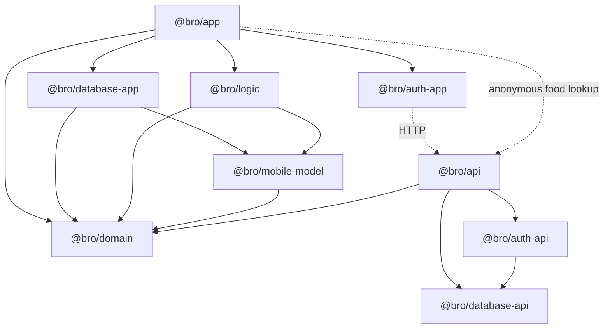

# Architecture

Bro separates shared product definitions, mobile application logic, device
persistence, server integrations, and presentation. Nx tags plus ESLint module
boundaries enforce the direction; `pnpm nx graph` is the authoritative resolved
dependency graph.

## Package responsibilities

- `@bro/domain` is dependency-light shared definition: catalogues, metric and
  intake definitions, composition rules, calendar vocabulary, and unit logic.
- `@bro/mobile-model` owns persistence-independent record contracts used by
  on-device repositories and pure logic.
- `@bro/logic` calculates projections, goals, habits, health rollups, insights,
  reminders, trends, and export data. It does not own SQLite access or UI.
- `@bro/database-app` owns device database connections, schemas, migrations,
  and parameterised-SQL repositories.
- `@bro/app` owns Expo Router routes, screens, feature stores, presentation,
  localisation, and native integrations.
- API and app auth/database packages remain split so Postgres drivers, server
  secrets, and server-only Better Auth configuration cannot enter the mobile
  bundle.

Directories may nest, but npm package names are flat after the scope:
`packages/database/app` is `@bro/database-app`. Both `packages/*` and
`packages/*/*` must remain in `pnpm-workspace.yaml`.

## Data ownership

The mobile app uses three independent device stores; the API uses Postgres.

| Store | Contents | Lifecycle |
| --- | --- | --- |
| `bro.db` | Product records: observations, notes, reminders, reviews, goals, habits, daily rollups, intake, and preferences | Durable local source; future sync candidate |
| `bro-local.db` | Health connections, imported raw samples, and food-search cache | Device-only and rebuildable |
| `bro-device.db` | Onboarding, appearance, installation identity, app-lock preferences, and remote-session hints | Device-only key/value settings; never replicated |
| Postgres | Better Auth users, accounts, sessions, and verification records | API authority for remote identity |

Health import keeps durable daily rollups in `bro.db` and disposable raw source
data in `bro-local.db`. Local-data deletion owns both product and disposable
tables, while device settings and account state follow their separate user
contracts.

### Device database access

Drizzle schema files drive migration generation, but runtime reads and writes
use one repository class per domain with hand-written parameterised SQL over
Expo SQLite. Migration SQL and its journal are compiled into TypeScript
manifests because Metro cannot load migration files from disk at runtime.

`PRODUCT_TABLE_NAMES` and `LOCAL_TABLE_NAMES` are the deletion inventories and
must change with their schemas. Follow the local
[repository recipe](../packages/database/app/src/repositories/README.md) when
adding a table or repository.

### API database access

The API uses Drizzle for both schema and runtime Postgres queries. Better Auth
schema-affecting options are shared by the runtime factory and CLI config; its
generated tables live in `@bro/database-api`.

## Runtime boundaries

The app starts and performs normal product reads and writes locally. Current
network boundaries are deliberately narrow:

- Better Auth requests for optional account actions.
- Anonymous food search, reference lookup, and barcode-number lookup through
  the API's Open Food Facts adapter.

HealthKit and Health Connect are native device integrations, not API-backed
sync. Remote replication of `bro.db` is not implemented.

## App flow

Expo Router files are thin route adapters. Screens coordinate presentation and
mutations; feature stores compose repositories and pure logic. Shared
components own generic presentation and interaction, not product or data
behaviour.

Screens normally load stores through `useFocusStoreLoad` when returning to a
screen should refresh it, or `useStoreLoad` for a loader tied to stable route
input. A feature store remains injectable as a screen prop for tests. Mutations
stay explicit in the screen, followed by `setData` with the returned snapshot
or `reload()`.

## Localisation

User-facing app copy lives in typed TypeScript catalogues under
`apps/app/src/i18n`. Authored product content stays in `@bro/domain`; the app's
content adapter translates it on the way to a screen. System-owned iOS prompt
copy is the exception and lives in `apps/app/locales/en.json`.

Copy language follows the device with English fallback. Dates, numbers, and
units use the device locale through `Intl`, independently of the fallback copy
language. `EXPO_PUBLIC_PSEUDO_LOCALE=1` enables the layout-testing pseudo-locale.
