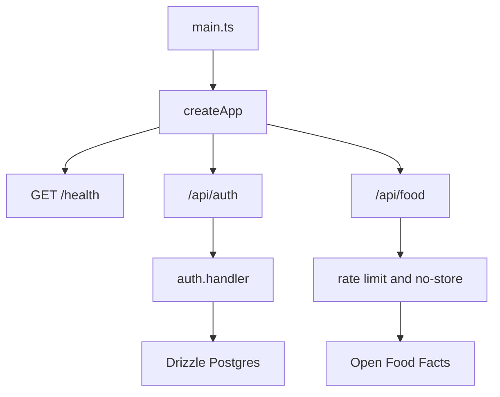

# Hono API server

`apps/api/src/main.ts` is the runtime entrypoint: it creates the dependency-injected Hono app and binds `app.fetch` with `@hono/node-server`. `createApp` in `apps/api/src/app.ts` is separately exported so tests use `app.request(...)` without opening a port. The API composes [server authentication](../auth/server.md), [server database](../database/server.md), and the anonymous food provider used by [mobile product workflows](../app/product-workflows.md).

## Registered routes

- `GET /health` returns `{ status: "ok" }`.
- `GET` and `POST /api/auth/*` delegate raw requests to Better Auth. This includes password-confirmed `delete-user`; the container-backed `account-deletion.test.ts` verifies rejected deletion preserves rows and accepted deletion removes user, account, and sessions.
- `GET /api/food/search?q=<query>` searches Open Food Facts. The query must be 2–120 trimmed characters.
- `GET /api/food/barcode/:code` accepts 8–14 digits, and `GET /api/food/:ref` accepts `off:<digits>`; both return an item or 404.

This is the complete current server surface: ordinary product records remain device-local and are not API routes.

## Food lookup service

`createFoodRoutes` injects a `FoodProvider`, `InMemoryFoodRateLimiter`, optional observer, clock, and proxy-header policy. Every food response uses `Cache-Control: no-store`; rate limiting defaults to 30 requests per 60 seconds. Buckets use a coarsened IPv4 /24 or IPv6 /64 address so callers are not collapsed into one bucket. The in-memory limiter is process-local and bounded; it is not a distributed production quota.

By default the peer socket address is used. `trustProxyHeaders` permits `cf-connecting-ip` or `x-forwarded-for` only when a deployment proxy overwrites them; otherwise a client can spoof its bucket. Over-limit requests return 429 and `Retry-After`; invalid input returns 400/404; upstream failures return 504 for a recognised timeout and 502 otherwise. `FoodRouteObserver` receives hit, miss, rate-limit, and upstream-error events without receiving raw query or address values.

CORS is deliberately different by subtree: `/api/auth/*` permits credentialed `Content-Type`/`Authorization` requests, while `/api/food/*` permits GET and `Content-Type` without credentials. Keep an anonymous lookup route separate from auth middleware and do not turn the optional food service into a prerequisite for local intake logging.

## Change and validation guidance

To add a route, define an injectable route module, register it from `createApp`, choose CORS/auth explicitly, and test it through `app.request`. If the route needs a session, use `withSession` but remember it only attaches nullable values; the handler owns the 401/403 decision. Add exported types through the module and API entrypoint only when consumers need them.

`apps/api/src/food.test.ts` is the focused suite for validation, mapping, timeout, rate-limit, and proxy-boundary behavior. It is the normal check for food changes: `pnpm nx test @bro/api --runTestsByPath src/food.test.ts`. `account-deletion.test.ts` starts Postgres via Testcontainers, so run it conditionally for auth/account-deletion or server-schema changes: `pnpm nx test @bro/api --runTestsByPath src/account-deletion.test.ts`. Run `pnpm nx run @bro/api:build` when changing the deployment bundle or Node ESM imports; a route unit test alone does not validate that consumer-facing build boundary.
