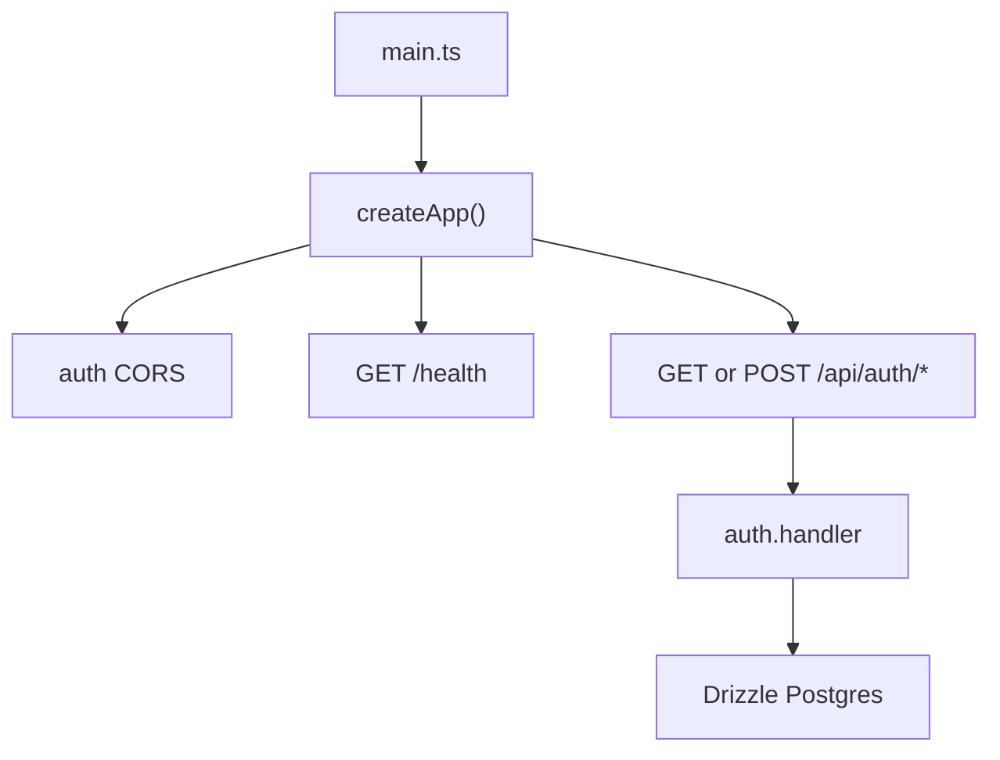

# Hono API server

`apps/api/src/main.ts` is the production/runtime entrypoint: it calls `serve` with `createApp().fetch` and the configured port. `createApp` is intentionally exported separately so request-level checks can use Hono's `app.request(...)` without binding a socket. The application mounts `health` and `authRoutes`; only the auth subtree receives credentialed CORS.

## Public routes and composition

- `GET /health` returns `{ status: "ok" }` from `apps/api/src/routes/health.ts`.
- `GET` and `POST /api/auth/*` delegate the raw `Request` to `auth.handler` in `apps/api/src/routes/auth.ts`. Better Auth owns the subtree's endpoint semantics.
- `withSession` in `apps/api/src/middleware/session.ts` calls `auth.api.getSession({ headers: c.req.raw.headers })`, then sets `session` and `user`. `SessionVariables` declares `session` as `NonNullable<SessionResult>["session"] | null` and `user` as `NonNullable<SessionResult>["user"] | null`, where `SessionResult` is `Awaited<ReturnType<Auth["api"]["getSession"]>>`. It is non-blocking for anonymous requests, so a protected handler must check `c.get("user")` or `c.get("session")` and return its own unauthorized response. This differs from the Better Auth route subtree: `/api/auth/*` delegates directly to `auth.handler` and is not a protected application route.

`apps/api/src/env.ts` validates `DATABASE_URL`, `BETTER_AUTH_SECRET`, and `BETTER_AUTH_URL`, defaults CORS to `http://localhost:8081`, and parses `PORT` with default `3000`. A missing or empty required value throws the exact message `${name} must be set. Copy .env.example to .env and fill it in.` during module initialization, before the server starts; `PORT` is `Number(process.env.PORT ?? 3000)`, so a nonnumeric supplied value becomes `NaN` and is passed to the Node server rather than rejected by `env.ts`. It constructs `db` with `createApiDb` and `auth` with `createAuth`; packages do not read process environment themselves.

For `/api/auth/*`, CORS uses `env.corsOrigin`, allows `Content-Type` and `Authorization`, allows `GET`, `POST`, and `OPTIONS`, and sets `credentials: true`. `CORS_ORIGIN` overrides the localhost default and `PORT` controls `serve`; the required database/auth values flow into the Drizzle client and Better Auth factory.

This flow shows the server composition and the only currently registered route families.

## Build and validation

Use `pnpm exec nx run @bro/api:serve` to have Nx run the development esbuild bundle in watch mode and restart Node after successful rebuilds. Development bundles third-party packages so the output can run directly from `dist`; production keeps them external for the prune/deployment targets. Use `pnpm exec nx run @bro/api:build` for the production Node ESM output. The package uses `nodenext`-style `.js` relative import suffixes. Run `pnpm exec nx run-many -t typecheck` and `pnpm lint` for cross-package validation. There are no tracked API test files; the exported `createApp` is the narrow seam for adding request tests.

The API does not own domain data routes beyond authentication yet. New protected routes should register a route module in `createApp`, apply `withSession` when session context is needed, and keep authorization decisions in the route rather than changing the middleware's anonymous behavior.
