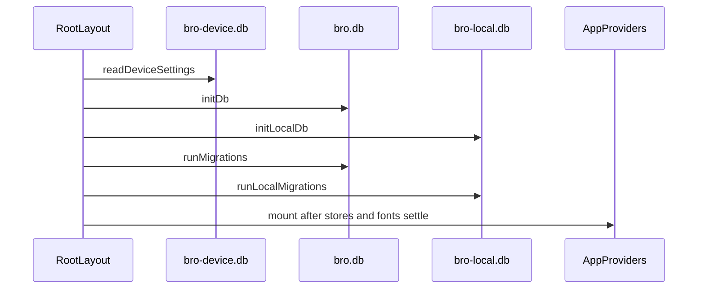

# Expo mobile client

`apps/app` is the Expo Router runtime for the offline-first product. Its route files under `src/app/` are deliberately thin adapters; screens, feature stores, local repositories, and pure calculations do the product work described in [mobile product workflows](product-workflows.md). The client depends on [mobile database](../database/mobile.md) for device state, [shared domain and logic](../architecture/shared-domain.md) for vocabulary and derivations, and [mobile authentication](../auth/client.md) only for optional remote identity.

## Startup and route gates

`RootLayout` in `apps/app/src/app/_layout.tsx` prevents the splash from hiding, reads synchronous device settings, applies appearance, opens `bro.db` then `bro-local.db`, and runs both migration manifests. The relational opens are sequential because the web SQLite VFS cannot safely perform first opens for separate databases concurrently; migrations run together only after both handles exist. Fonts and storage must both settle before the splash hides.

This sequence is the storage prerequisite for routing; a failure renders `StorageError`. Its retry path closes both database handles and device settings before repeating startup, which avoids reusing a half-migrated handle.

Once ready, `DeviceSettingsProvider` supplies onboarding, appearance, and remote-session hints. `RootNavigator` uses Expo Router `Stack.Protected`: incomplete onboarding can access only `onboarding`; complete onboarding can access tabs and feature stacks; sign-in and sign-up remain available routes. `AppProviders` additionally mounts health-import and reminder side effects and the auth provider. Do not move repository initialization into screens: a screen can assume the stores have already migrated.

## Tabs and navigation ownership

`TabLayout` owns the four top-level jobs: Journal (`/`), Intake, Body, and Life. `TabShell` keeps visited tabs mounted (`detachInactiveScreens: false`) but lazy-loads them, retains a common header, gives the Journal direct links to insights and history, and shows `QuickLogFab` on Journal, Intake, and Body. `BodyLogSurfaceProvider` lets that FAB open body logging when appropriate; `TodayHeaderMonthProvider` supplies the Journal header month. Nested routes are registered in `RootNavigator`, not inferred from screen imports.

When changing navigation, update the route adapter in `src/app/`, the relevant protected stack declaration, and tab shell only when the route is a top-level tab or changes shared chrome. Preserve the lazy-but-retained tab invariant: dashboards initialise repositories and charts on first visit and are kept alive for quick returns. Focused checks are `apps/app/src/app-navigation.test.tsx` for route reachability and `apps/app/src/tab-layout.test.tsx` for header, retention, and quick-log behavior.

## Platform and build boundary

`apps/app/package.json` sets `expo-router/entry`; `app.json` and generated `android/` and `ios/` projects form the native build surface. The app uses Expo Router, health integrations, notifications, local SQLite, and Unistyles. Native project files are generated/platform configuration, not ordinary screen code; change them only with the related Expo configuration or native dependency requirement. `tools/scripts/brand-assets.mjs` generates brand assets and `pnpm brand:check` checks they match their sources.

The mobile app's public consumer boundary is the installed Expo bundle, not a feature-store unit test. For an ordinary screen or navigation change, run the closest Jest suite, for example `pnpm nx test @bro/app --runTestsByPath src/tab-layout.test.tsx`, then use `pnpm nx run @bro/app:start` for an interactive route smoke test. Run `pnpm android:build` or an EAS/native build only when native configuration, a native dependency, or generated Android/iOS project files change; do not hand-edit generated assets to satisfy that check.
