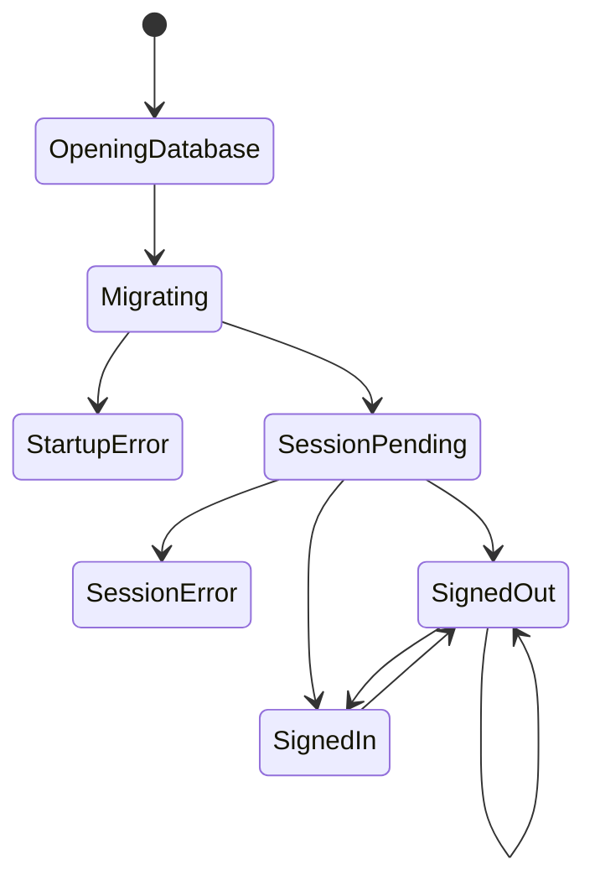

# Expo mobile client

`apps/app/index.js` and the Expo configuration bootstrap the application; `apps/app/src/app/App.tsx` exports the React `App` component. Startup is local-first: `initDb()` and `runMigrations()` complete before `AuthProvider` mounts. The splash screen is held during that work and hidden in `finally`; a failure renders a startup error rather than running against an unknown local schema.

`Root` is a deliberate conditional renderer rather than a navigation stack. The priority is database startup error, database loading, pending auth session, auth session error, signed-in home, then signed-out sign-in/sign-up. Screens call the `useAuth` context actions rather than reaching into the client directly. `apps/app/app.json` owns the Expo scheme `app`, which must match both auth halves.

A failed `initDb` or `runMigrations` sets the terminal `error` state for that mount; the code hides the splash and does not retry automatically. `initDb` clears its in-flight marker only when opening succeeds, while a migration failure leaves the opened handle in module state; retry therefore requires an external remount/reload and, for deterministic tests, `closeDb()` before another startup attempt. Auth session errors are separate and are rendered by `Root` after the database is ready.

This lifecycle summarizes the states represented by `App` and `Root`; sign-in and sign-out transitions are performed by `AuthProvider` actions.

## Build and change surfaces

Metro is configured in `apps/app/metro.config.js` for the workspace/package layout and SVG transformer. `apps/app/package.json` delegates EAS's post-install hook to `tools/scripts/eas-build-post-install.mjs`; see [automation](../development/automation.md). Expo dependencies must remain compatible with SDK 56. The app has no navigation library yet, so adding a screen means wiring the conditional flow and callback in `App.tsx`.

Validate with `pnpm exec nx run app:start`, `pnpm exec nx run-many -t typecheck`, and `pnpm lint`. No tracked screen test files are present; the auth context and `App` composition are the narrow consumer-facing seams for future React Native tests.
