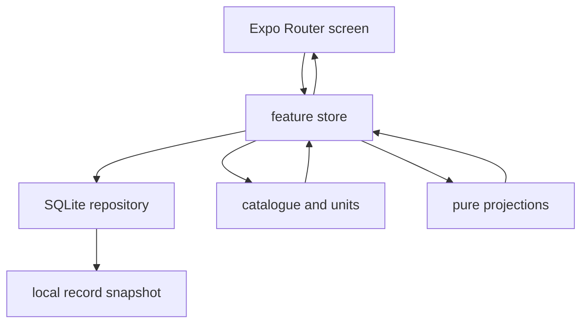

# Mobile product workflows

Bro is a local-first wellbeing journal. The application routes described in [the mobile client](mobile-client.md) delegate to screens and feature stores; those stores compose the repository APIs in [mobile database](../database/mobile.md) with catalogue and calculation APIs in [shared domain and logic](../architecture/shared-domain.md). The API is not the product-data authority: it serves optional identity and anonymous food lookup only.

## Product areas and ownership

| Area | Primary screen and store seam | Data and calculation boundary | Focused tests |
| --- | --- | --- | --- |
| Journal | `screens/home/home-screen.tsx`, `check-in/check-in-store.ts`, `notes/notes-store.ts` | observations, day notes, habits, trends, and insight projections | `home-screen.test.tsx`, `check-in-flow.test.tsx`, `notes-flow.test.tsx` |
| Intake | `screens/intake/`, `intake/intake-store.ts`, `intake/intake-search-store.ts` | consumables, events, local food cache, totals, portions, and goals | `intake-flow.test.tsx`, `intake-store.test.ts`, `intake-screen.test.tsx` |
| Body | `screens/body/`, `body/body-store.ts`, `health/import-engine.ts` | observations, tracked metrics, raw health samples, rollups, baselines, and trends | `body-flow.test.tsx`, `body-store.test.ts`, `health-import-effects.test.tsx` |
| Life | `screens/life/`, `review/review-store.ts`, `habits/habits-store.ts` | wheel assessments, focus areas, goals, habits, challenges, adherence, and cadence | `review-flow.test.tsx`, `habits-store.test.ts`, `life-screen.test.tsx` |
| Settings | `screens/settings/`, device-settings provider, reminder and health effects | device-only preferences, units, notifications, export, deletion, and optional account | `local-data-continuity.test.tsx`, `export-flow.test.tsx`, `delete-local-data-flow.test.tsx` |

## Data flow and historical snapshots

This flow keeps writes explicit and local. Stores load a view snapshot, screens perform a mutation, and then the store returns or reloads the current snapshot. Keep business rules out of generic components and do not make the screen issue arbitrary SQL.

The product's core persistence rule is catalogue, overlay, snapshot. Catalogues provide stable authored vocabulary; user choices and custom content overlay it; logged intake and completed reviews snapshot display-relevant names and values. For example, an `IntakeEvent` contains scaled constituents and the name at log time, while references to a consumable are for re-lookup rather than historical display. Changing a catalogue therefore must not rewrite prior records.

## Intake and anonymous food lookup

The Intake tab uses one event model for food, drinks, nicotine, supplements, and other consumables. `IntakeStore` reads enabled streams and event history, groups same-sitting entries, and asks `@bro/logic` for daily/period totals, usual bands, and goals. Food search keeps saved/recent content locally and may call the anonymous [API food service](../api/server.md#food-lookup-service); a provider failure must leave local logging functional. The API client contract is typed by `@bro/domain/food-search`, while the cache is device-local.

When adding an intake kind, constituent, or portion rule, begin in the domain catalogue and unit/portion contracts, then update the store presentation and repository schema only if a persisted shape changes. Test conversion and projection rules in `packages/domain` or `packages/logic` first; then use `apps/app/src/intake-store.test.ts` for store composition and `intake-flow.test.tsx` for the consumer flow. An API route change is only needed for external lookup, not ordinary local logging.

## Optional identity and local-data continuity

A remote account does not partition or own the journal. `AuthProvider` records only a device-settings hint about a remote session; it deliberately does not attach product rows to a remote user. Sign-in, sign-out, account switching, and successful account deletion must retain `bro.db` content. `apps/app/src/local-data-continuity.test.tsx` is the focused acceptance test for this invariant and also demonstrates that product and disposable local state open as separate SQLite stores.

For changes to account-facing screens, read [mobile authentication](../auth/client.md) and run that continuity test in addition to the screen's focused test. A remote session marker may trigger one session check on next startup, but it must never become a synchronization, deletion, or authorization key for local product data.

## Change routing

Use a feature store as the canonical seam for a new view-level operation: inject repositories and clock/ID dependencies where existing stores do, return a presentational snapshot, keep a screen prop injectable for tests, and export no new public API unless another package consumes it. Use `useFocusStoreLoad` when revisiting a screen must refresh its data and `useStoreLoad` for stable route input. Run a focused Jest file with `pnpm nx test @bro/app --runTestsByPath src/<test-file>`; package typechecking or a native build is conditional on cross-package or native changes, not a default for screen copy and layout work.
