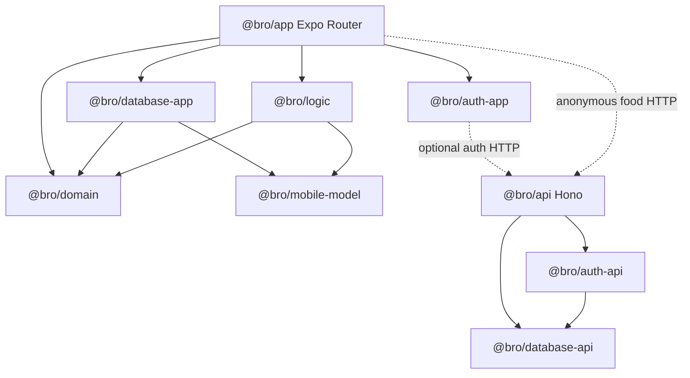

# Repository architecture

Bro is a private Nx + pnpm workspace for an offline-first men's wellbeing journal. `@bro/app` is the Expo Router mobile application and `@bro/api` is a small Node Hono service. The app writes product data to local SQLite and remains usable without an account; the API provides optional identity and anonymous food lookup, not product-data synchronization.

This graph separates server-only Postgres/Better Auth code from the React Native bundle and keeps calculations downstream of storage-independent definitions.

## Major concepts

- [Mobile client](../app/mobile-client.md) owns Expo startup, Router guards, tabs, native integrations, and screens. [Mobile product workflows](../app/product-workflows.md) is the canonical guide to feature stores and user-facing domains.
- [Mobile database](../database/mobile.md) owns three device stores, migrations, and repositories. It has separate durable-product, disposable-local, and device-settings lifecycles.
- [Shared domain and logic](shared-domain.md) owns catalogues, units, record contracts, and pure derivations; it must stay free of UI, network, and SQLite implementation dependencies.
- [API server](../api/server.md) owns Hono composition, health, auth delegation, and food-provider integration. [Server authentication](../auth/server.md) and [server database](../database/server.md) own the injected identity/Postgres boundary.
- [Mobile authentication](../auth/client.md) owns secure optional identity without making it ownership of local product data.

## Workspace and package boundaries

Package names flatten nested directory paths: `packages/database/app` is `@bro/database-app`. Both `packages/*` and `packages/*/*` are workspace globs. Nx resolves project and target configuration; use `pnpm nx show projects` and `pnpm nx show project <name>` rather than assuming targets from a directory. Package manifests carry Nx metadata and package entrypoints/bundles are consumer boundaries.

A public cross-package API requires the defining implementation, its barrel export, the package root export, any registration/factory wiring, and a consumer import/test. Passing a local module test is not sufficient if `@bro/<package>` cannot resolve the new symbol. Run narrow package tests first; run typecheck when exports or package edges change. Keep API-side Node ESM `.js` relative imports separate from Expo-side extensionless imports.

## Scope boundaries

Remote product-data sync, paid entitlements, biometric protection, encrypted SQLite, and a second food-data provider are not shipped behavior. HealthKit/Health Connect are device integrations, not API sync. The source of truth for user-facing product intent is `docs/product.md`; source code and tests prevail if prose conflicts.
