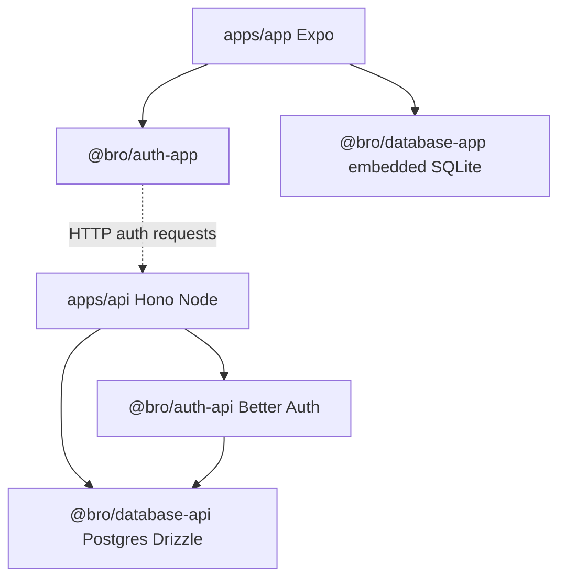

# Repository architecture

Bro is a private Nx + pnpm workspace with two runtime applications and four boundary libraries. `apps/app` is an Expo SDK 56 mobile client; `apps/api` is a Node Hono server. `@bro/auth-app` and `@bro/database-app` are bundle-safe client libraries, while `@bro/auth-api` and `@bro/database-api` contain server-only Better Auth, Postgres, Drizzle, and secret-bearing integration.

The API database is authoritative for authentication. The mobile database is an independent embedded store used so UI reads/writes do not wait on network access; remote Turso synchronization is optional low-level scaffolding and is not scheduled by the app. The app and API halves never import each other, preventing server drivers and secrets from entering the React Native bundle.

## Package and build graph

Package names flatten nested directories (`packages/database/api` becomes `@bro/database-api`) and are discovered by the `packages/*/*` pnpm workspace glob. Nx targets live in package manifests rather than project files. The API bundles from `apps/api/src/main.ts`; Expo starts from `apps/app/index.js`; database/auth generation targets write generated schema or migration artifacts that runtime code consumes.

The most central change paths are [API composition](../api/server.md), [server authentication](../auth/server.md), [server database](../database/server.md), and [mobile startup/storage](../app/mobile-client.md). Cross-system ordering and request flow are collected in [runtime workflows](workflows.md); commands and module-boundary rules are in [development operations](../development/operations.md).

## Ownership boundaries

- API owns HTTP routing, environment validation, session context, and server lifecycle.
- Server auth owns Better Auth options/factory; server database owns Postgres schema/client/migrations.
- Mobile auth owns client transport, secure session storage, and React context; mobile database owns embedded connection/migrations/repositories.
- The mobile UI owns startup gating and presentation, not SQL or raw auth calls.

No navigation, application domain repository, or API business route beyond auth/health is currently implemented; these are scope boundaries, not undocumented services.
