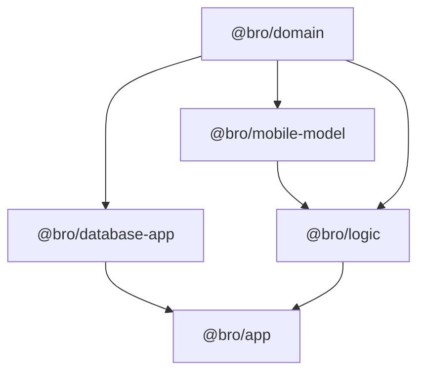

# Shared domain, records, and logic

Three packages separate product meaning from persistence and UI. `@bro/domain` owns dependency-light catalogues, calendar primitives, tracking types, and units; `@bro/mobile-model` owns persistence-independent record contracts; `@bro/logic` derives results from already-read records. This ordering lets [mobile database](../database/mobile.md) depend on domain and records without creating a circular dependency, while [mobile product workflows](../app/product-workflows.md) can compose pure calculations with local data.

The diagram is the intended dependency direction: storage and the UI consume definitions, but definitions do not import platform or SQLite code.

## Ownership by package

- `packages/domain/src/content/` defines authored catalogues: metrics, check-in assignment, intake constituents and consumables, drinks/nicotine/food search, habits/challenges, insights, and life areas. `units/` provides dimension, parsing, conversion, formatting, and locale defaults. Deep imports such as `@bro/domain/consumable` and `@bro/domain/metric-registry` expose specialised contracts; `src/index.ts` is the smaller general barrel.
- `packages/mobile-model/src/records.ts` describes durable record shapes such as `Consumable`, `IntakeEvent`, assessments, habits, observations, reminders, and health records. Snapshot fields are intentional historical data, not denormalization to remove casually.
- `packages/logic/src/index.ts` is the public pure-calculation barrel: intake totals/projections, health mapping and rollups, habit adherence/streaks, goals, trends, reminders, measurement baselines, insights, local-day labels, and export serialization. It runs under Vitest because it has no database handle, network, React, or native imports.

## Extension recipes

**Catalogue or units change.** Update the owning `@bro/domain` module and its direct test, preserve stable slugs and dimension compatibility, then update consumer presentation in the app. If an existing record snapshots the value, verify old records still render from their snapshot. Run the package's focused Vitest test before an app flow test. A schema migration is not implied by a catalogue-only change.

**New persisted product fact.** Define a record contract in `@bro/mobile-model` if it crosses repository/logic boundaries; add schema, repository, migration, and exports in [mobile database](../database/mobile.md); then implement pure derivation in `@bro/logic` and a feature-store consumer. The shipped surface includes the package barrel(s), not only the defining module. Run the contract/unit test, repository/migration test, then the closest app flow.

**New derived result.** Keep inputs explicit and read-only in `@bro/logic`; do not call repositories or `Date.now()` implicitly when the calculation can receive a clock/input. Export from `packages/logic/src/index.ts` if an app or another package imports it. Test initial/missing input, boundary values, unchanged cases, and relevant composition. The API has no claim on these local derivations unless it gains a separately designed server feature.

## Change safety

`packages/domain/src/content/metric-registry.test.ts` is the narrow retrievable suite for metric definitions and check-in assignments. `packages/logic/src/intake/totals.test.ts`, `measurements/baseline.test.ts`, `insight/engine.test.ts`, and `export/check-in-export.test.ts` cover representative calculation invariants. Use `pnpm nx test @bro/domain --runTestsByPath src/content/metric-registry.test.ts` or the analogous `@bro/logic` command for ordinary changes. Run broad typechecks only when exports, cross-package types, or dependency edges change.
