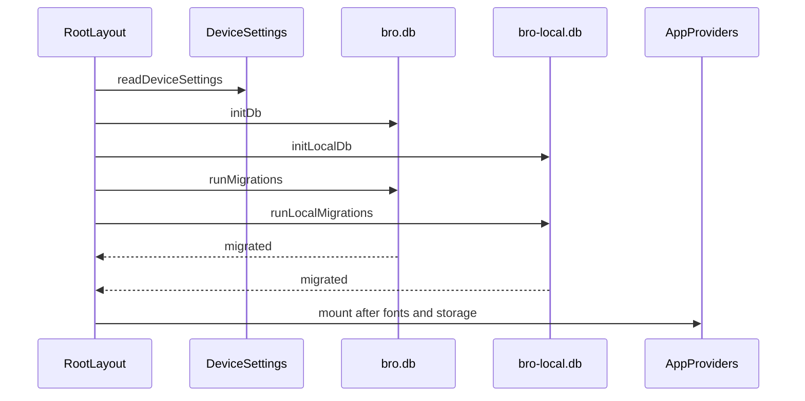

# Runtime workflows

This page collects cross-system ordering. Detailed mobile presentation is owned by [mobile client](../app/mobile-client.md), local storage by [mobile database](../database/mobile.md), and optional identity by [mobile authentication](../auth/client.md).

## Mobile startup and routing

`RootLayout` suppresses automatic splash hiding, reads synchronous device settings, applies appearance, opens `bro.db` and `bro-local.db` sequentially, then migrates both in parallel. It waits for fonts as well as storage before mounting `DeviceSettingsProvider`, health/reminder effects, `AuthProvider`, and the protected Expo Router stack. A storage failure presents retry; retry closes both handles and settings before restarting.

Onboarding is the first Router guard. After completion, the tabs and nested routes are available; sign-in/sign-up screens are outside the onboarding-complete group because an account remains optional. Read [mobile product workflows](../app/product-workflows.md) for the screen/store data flow.

## Optional identity

`AuthProvider` receives the device setting `hasStoredRemoteSession`. Only a true marker mounts `RemoteSessionBridge` and requests a Better Auth session. A resolved absent session or 401 clears that marker; ordinary offline failure does not. Sign-in/up set the marker, sign-out clears it before best-effort remote revocation, and deletion clears the local cache/marker after the password-confirmed server action. None of these transitions delete, switch, or scope product rows.

The server delegates `/api/auth/*` to Better Auth, which uses injected Drizzle/Postgres. This is a remote identity flow, not a prerequisite for journal access. See [server authentication](../auth/server.md) and [server database](../database/server.md) for generated-schema ordering.

## Anonymous food lookup

The Intake flow may call `/api/food` for Open Food Facts search/ref/barcode lookup. `createFoodRoutes` validates input, sets `no-store`, rate-limits a coarse address bucket, and delegates to its injected provider. Invalid, unavailable, and rate-limited remote responses must not prevent local intake entries or cache reads. The API behavior and proxy trust boundary are owned by [API server](../api/server.md).

## Focused lifecycle checks

Use `pnpm nx test @bro/app --runTestsByPath src/root-layout.test.tsx` for startup, retry, and provider ordering; `src/auth-provider.test.tsx` for marker transitions; and `src/local-data-continuity.test.tsx` for account lifecycle preservation. Use the API food test for network lookup behavior. Native or full-app smoke testing is conditional on changes to Expo/native adapters, migrations, or real session transport.
