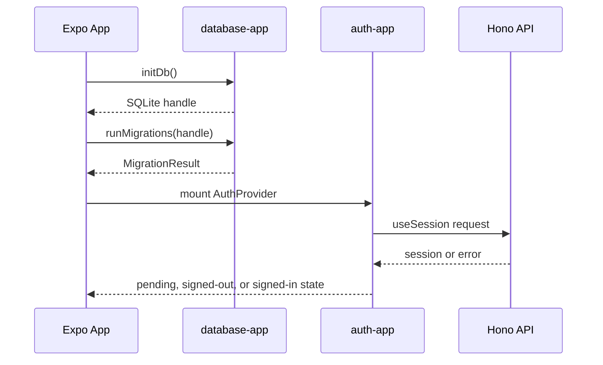

# Runtime workflows

## Mobile startup

`App` prevents splash auto-hide, awaits `initDb`, runs `runMigrations`, and only then mounts `AuthProvider`. A database-open or migration failure is rendered as `StartupError`; successful initialization enters Better Auth session loading. This ordering makes local schema readiness a prerequisite for the signed-in/out UI.

The diagram shows the startup boundary and the later session request; the local database is not used as the auth session store.

## Authentication

Sign-up and sign-in screens call `useAuth`, whose provider actions call Better Auth email endpoints through `authClient`. The Expo plugin stores session credentials in SecureStore and uses scheme `app` for redirects. On the server, CORS covers `/api/auth/*`, the route delegates the raw request to Better Auth, and Better Auth persists users/accounts/sessions through Drizzle Postgres. `withSession` can resolve a caller's session for future routes but intentionally does not reject anonymous requests.

## Database changes

Server changes flow from Better Auth options or Drizzle schema to generated `database/api/src/schema`, then SQL under `database/api/drizzle`, then `db:migrate` against Postgres. Mobile changes flow from `database/app/src/schema.ts` through Drizzle Kit and the migration-manifest generator; the manifest is bundled, and the app applies unapplied IDs transactionally at startup. A failed migration prevents the app from proceeding.

## Boundaries and failure modes

The API requires its database URL, auth secret, and auth URL before composing dependencies. The mobile auth client requires `EXPO_PUBLIC_API_URL`; the mobile database rejects partial Turso credentials. These checks fail early. The app does not currently invoke `triggerSync`, so local writes remain device-local unless a future lifecycle explicitly adds sync scheduling and conflict policy.
