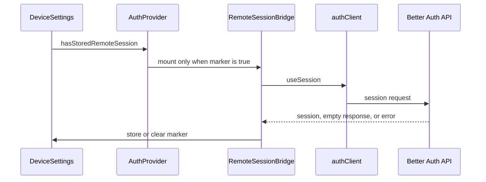

# Mobile authentication client

`packages/auth/app/src/client.ts` creates `authClient` with `EXPO_PUBLIC_API_URL`, Better Auth's Expo plugin, scheme `app`, `expo-secure-store`, and storage prefix `bro`. It is paired with [server authentication](server.md): plugin, app scheme, trusted-origin, and generated-schema changes must be made on both sides. It is consumed by [the mobile client](../app/mobile-client.md) only after its local stores are ready.

## Session lifecycle

`AuthProvider` exposes nullable session/user state, `remoteIdentity`, and `signIn`, `signUp`, `signOut`, `refreshRemoteIdentity`, and `deleteAccount` through `useAuth`. It deliberately splits the session hook into `RemoteSessionBridge`: when `hasStoredRemoteSession` is false, that bridge is absent and no remote session request is issued. This keeps a never-registered/offline-first user out of remote startup work.

A resolved empty session or 401 clears the marker; an offline/non-401 failure does not, because it proves nothing about a stored session. `signIn` and `signUp` set the marker once Better Auth returns a user. `signOut` clears it before best-effort remote revocation. `deleteAccount` calls the password-confirmed server action, clears the Expo credential cache through `signOut`, and then clears the marker. These are startup hints only, never a foreign key or permission boundary for product data.

## Change surface and tests

Screens use `useAuth`, not direct `authClient` calls. A client plugin change spans its implementation, `packages/auth/app/src/index.ts` exports, the server plugin/options and schema generation, plus the real Expo transport/session behavior. The `@ts-expect-error` around `expoClient` is an upstream declaration workaround; remove it only after a compatible dependency update.

Run `pnpm nx test @bro/app --runTestsByPath src/auth-provider.test.tsx` for marker/session transitions and `pnpm nx test @bro/app --runTestsByPath src/local-data-continuity.test.tsx` for sign-in/out/switch/deletion data continuity. The latter is required for account lifecycle changes. Start Expo for a consumer-facing session smoke test; use server account-deletion integration tests only when changing the server contract.
