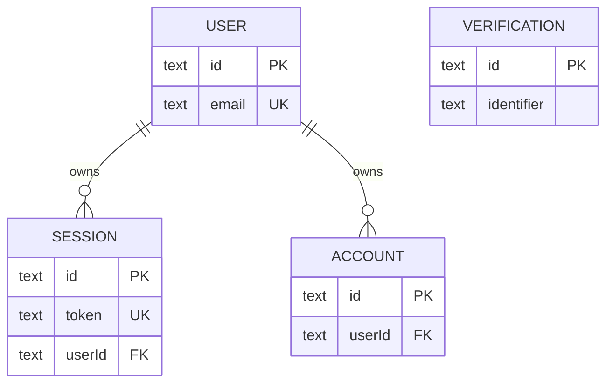

# Server database

`@bro/database-api` owns the API-only Postgres boundary. `createApiDb(connectionString)` creates the `postgres` client and Drizzle client over exports from `src/schema/index.ts`; `ApiDb` is injected into [server authentication](../auth/server.md). The API environment validates the database URL before composition. This database is authoritative for remote users/accounts/sessions, not for the offline product journal described by [mobile database](mobile.md).

The current schema is Better Auth-generated `user`, `session`, `account`, and `verification` tables in `src/schema/auth.ts`. User email and session token are unique; account/session rows reference users with cascade deletion. The account lifecycle integration suite is the consumer-facing proof that a generated schema, Better Auth handler, and Hono app work together.

This is the current remote identity model; it has no product-data table or sync mapping.

## Change recipe

For a Better Auth option change, follow [server authentication's schema contract](../auth/server.md#schema-and-lifecycle-contract). For a separately designed server-owned domain, add Drizzle tables/relations under `src/schema`, export them through `src/schema/index.ts`, generate and inspect migration SQL, apply it, then implement the injected query in its owning API route/service and mount that route in `apps/api/src/app.ts`. Use `withSession` plus handler-owned authorization for user-scoped resources. No generic repository or automatic bridge to mobile SQLite exists.

`pnpm nx run @bro/database-api:db:generate` creates migration output; `pnpm nx run @bro/database-api:db:migrate` applies it. Run `pnpm nx test @bro/api --runTestsByPath src/account-deletion.test.ts` conditionally when schema/auth deletion behavior changes; it requires Docker/Testcontainers. Run the API build for package/deployment boundary changes, not for an isolated migration inspection.
