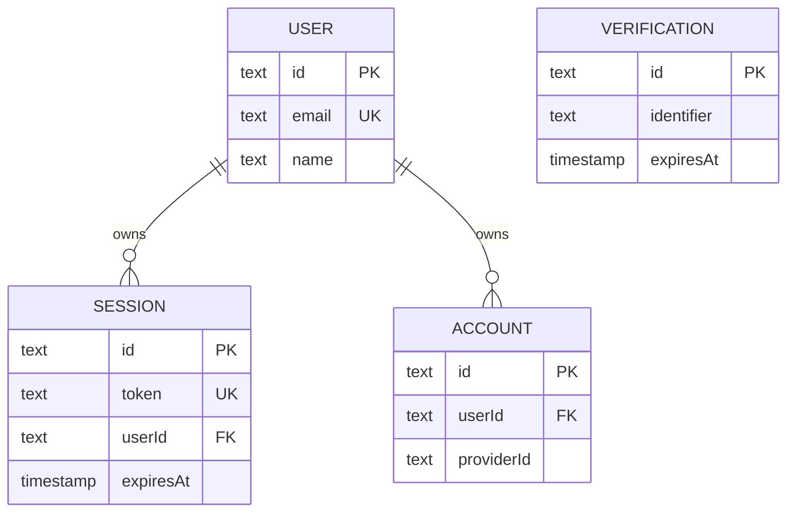

# Server database

`@bro/database-api` owns the API database boundary. `createApiDb(connectionString)` creates a `postgres` client and Drizzle client with the schema exported from `src/schema/index.ts`; callers supply the connection string. `ApiDb` is the inferred client type consumed by [server authentication](../auth/server.md).

The current schema is Better Auth's generated `user`, `session`, `account`, and `verification` tables in `src/schema/auth.ts`. Users have unique email addresses; sessions and accounts reference users with cascade deletion and indexed `userId` fields; sessions have unique tokens and expiry timestamps. Relations expose user-to-sessions/accounts and reverse session/account-to-user navigation.

This model is grounded in the generated Drizzle schema; `VERIFICATION` is independently indexed by identifier.

## Migration lifecycle

`nx run @bro/database-api:db:generate` runs Drizzle Kit from `packages/database/api`; schema changes produce SQL under `drizzle/`. `src/migrate.ts` requires `DATABASE_URL`, resolves the compiled/runtime `../drizzle` folder, and calls Drizzle's Postgres migrator. Apply with `nx run @bro/database-api:db:migrate` after starting the Postgres service.

For a new server-persisted domain, add its Drizzle table and relations under `src/schema`, export it through `src/schema/index.ts`, and implement domain queries in the owning API route/service using the injected `ApiDb`; this package has no generic repository abstraction and currently no non-auth domain service. Run `db:generate`, inspect the SQL, apply `db:migrate`, then mount the route in `apps/api/src/app.ts` and add `withSession` plus explicit authorization if it is user-scoped. There is no automatic bridge to `@bro/database-app`.

Changing Better Auth options requires regeneration first, then migration generation and application. Do not hand-edit the generated auth schema unless the generator's output is the intended source. Validate with database migration in a disposable/local Postgres, typecheck, and API build. No tracked database test suite is present.
